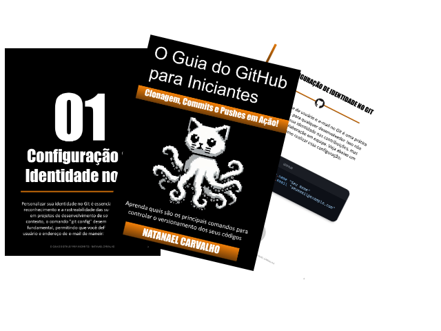

    

-------

# Projeto EBOOK Gerado por I.A.s

 > ℹ️ **NOTE:** Este é o repositório desenvolvido durante o curso no qual fui aluno na plataforma da [DIO](https://dio.me)

Projeto com o objetivo de gerar um ebook digital com as facilidades das ferramentas de IA. todos os prompts
seguem abaixo.

<a href="https://github.com/NatanCarFF/prompts-recipe-to-create-a-ebook/blob/main/output/ebook-guia-guithub-natanael-carvalho.pdf" title="View PDF now"> 📕Clique aqui para ler</a>

## 💻 Tecnologias utilizadas no projeto

- [ChatGPT](https://chat.openai.com/) 
- [Copilot](https://copilot.microsoft.com/images/create/pixelated-white-cat-with-black-background-and-octo/1-66353e019db4463a8da2a79b5c4e356f?id=aPr94ef4bTDOu6D%2b2MNklQ%3d%3d&view=detailv2&idpp=genimg&idpclose=1&thId=OIG2.hQVK6YrBGpUVJyjxXdUL&FORM=SYDBIC)
- [PowerPoint](https://www.microsoft.com/en/microsoft-365/powerpoint)
- [ShowCode](https://showcode.app/)

## 🧠 Prompts

ChatGPT：

|   Ação   | prompt                                                                                                                                                                                                                                                                         |
| :------: | ------------------------------------------------------------------------------------------------------------------------------------------------------------------------------------------------------------------------------------------------------------------------------ |
|  título  | Crie um título de um ebook sobre o tema de github, o ebookk é do nicho de programação e o subnicho é de github, o título deve ser épico e curto, e tenha uma temática de star wars no título, me liste 5 variações de títulos                                                        |
| conteúdo | crie um guia basico dos comandos do guithub com as regas abaixo:
crie um capitulo para ebook guithub com as regas abaixo:
FALE COMO SE FOSSE UM ESCRITOR PROFISSIONAL DE EBOOK E CRIE UM BREVE RESUMO SOBRE: 2.1 git add: Adicionando arquivos ao stage para o próximo commit.
{REGRAS}
> ORGANIZE NA ORDEM TÍTULO SIMPLES, INTRODUÇÃO DE ATE 5 LINHAS, RESUMO, EXEMPLO DE CÓDIGO
> ADICIONE OS CODIGOS DE EXEMPLO SE NECESSÁRIO
|

Copilot：

|  Ação  | prompt                                                                                 |
| :----: | -------------------------------------------------------------------------------------- |
| título | Gato branco pixelado com tentaculos no lugar das patas, background preto |

## ✨ Features

- Conteúdo gerado via ChatGPT
- Imagens geradas via Copilot

## 📚 Materiais

- Imagens utilizadas em `assets`
- ebook gerado durante as aulas em `output`

## 🛠️ Instruções de execução

Utilize os prompts acima nas ferramentas sugeridas para gerar o material base e utilize uma ferramenta de edição de documentos como power point, libreoffice , indesign para diagramação.

## 👨‍💻 Dev

    
    
&nbsp&nbsp&nbspNatanael Carvalho 
    &nbsp&nbsp&nbsp
    <a href="https://github.com/NatanCarFF">
    GitHub</a>&nbsp;|&nbsp;
    <a href="www.linkedin.com/in/
natanaelcarvalhodasilva">LinkedIn</a>
&nbsp;|&nbsp;
    <a href="https://www.instagram.com/natancarff/">
    Instagram</a>
&nbsp;|&nbsp;

  

---

⌨️ com 💜 por [Natanael Carvalho](https://github.com/NatanCarFF)

